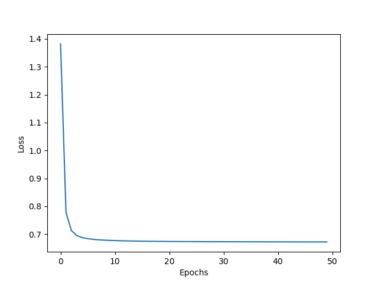
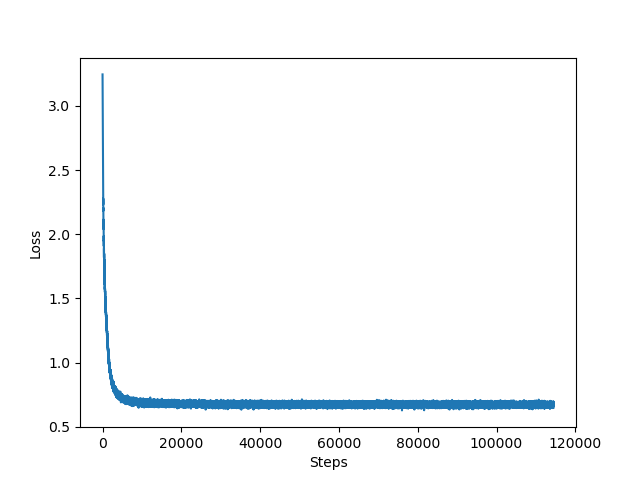

### Brief:
The problem is essentially to transfer a sentence from one "format" to another. So I used a simple encoder-decoder model to attempt to approach this problem. The model simply is trained using teacher enforcing technique to teach the decoder to infer the output from the encoder hidden states.

---
### Tokenization:
I observed from the problem constraints that the data has some form of structure that can be used to better tokenize the data rather than just using a character-based tokenizer. I had some ideas to try and produce smaller vocabulary.
- Generate custom tokens for each condition possiblity
  - using the `utils` I was able to generate all the [MONTH] [DAY] tokens to be tokenized as one token.
  - I also observed that the output month had the format `-MM-` so that was a way to remove the ambiguity of the month token; Having it mapped from one token in the input to one in the output.

---
### Model:
I used the Single layer LSTM for both the encoder and decoder. The encoder takes one input each time step a long with the previous step hidden state to finally generate the hidden and current states for the last time step, where the decoder takes the hidden state and the correct input (this is where the 'teacher enforcing' comes in) to generate the output, the probability for each step output being one of the output vocabulary of words.

---
### Training:
The code is CUDA compatible, training was done on CUDA enabled GPU. The training was done using Adam optimizer and a learning rate of 0.001. The training was done on a batch size of 64.

---
### Inference:
Using the same modeling code, but instead of having the target as input for each decoder timestep, the decoder’s previous timestep output is used as an input for the next timestep.
 

---
### Metrics:
I used the normal cross entropy loss for monitoring the output per token. I’m guessing that a better way to monitor the results might be BLEU or perplexity scores
 

---
### Plots:
 The training was done only on 50 epoch (resources and time limitation) and roughly 120000 steps.

The final prediction output currently isn’t making any sense given the input, although I tried to see the output while training it was close to the truth and makes sense, I’d say there’s a big chance that the model is still in early training phases and still converging.
For sure a transformer model or any other post-transformer big models would perform much better on similar training times, but I don't have a GPU in my machine to test that so I went the rough route of normal Seq2Seq. 
